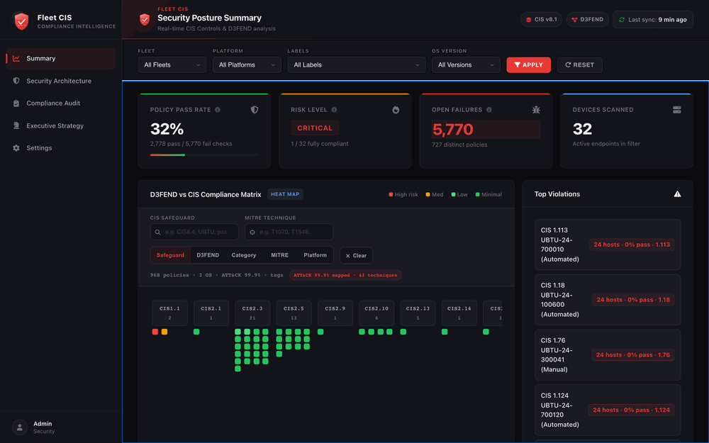
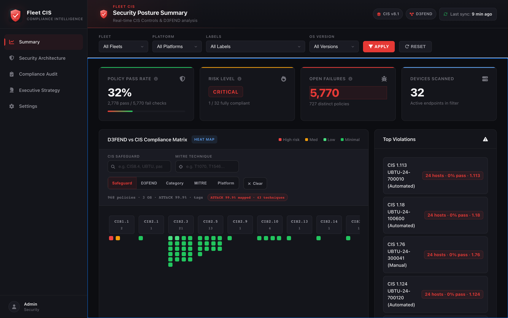
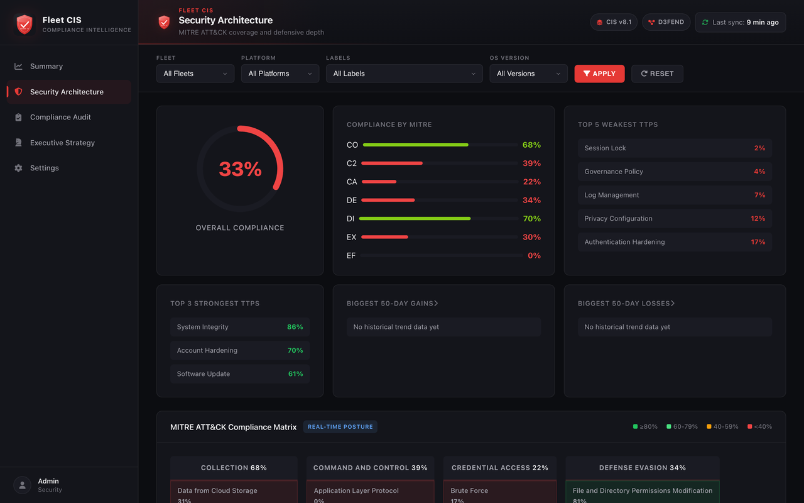
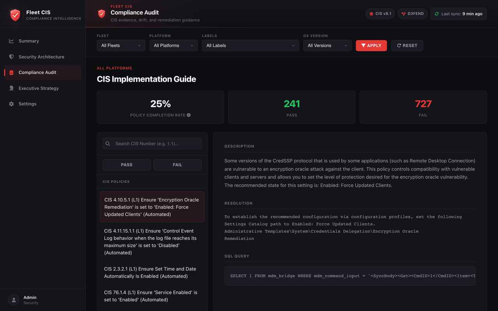
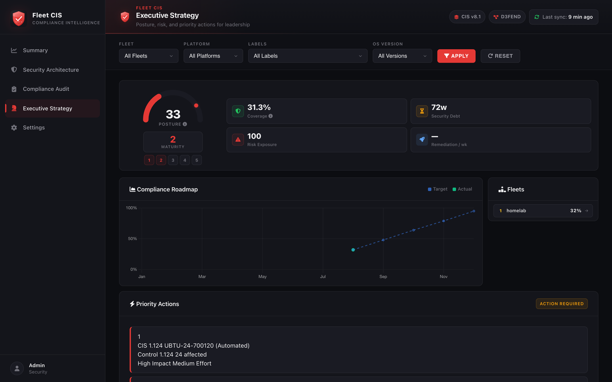

<p align="center">
  
</p>

<h1 align="center">Fleet CIS Compliance Dashboard</h1>

<p align="center">
  CIS Benchmark policy results from a Fleet instance, stored in Postgres and<br>
  presented as pass/fail compliance, MITRE ATT&amp;CK exposure, and D3FEND coverage.
</p>

<p align="center">
  <a href="https://opensource.org/licenses/MIT"></a>
  <a href="https://www.docker.com/"></a>
  <a href="https://www.python.org/"></a>
  <a href="https://www.postgresql.org/"></a>
  
  
</p>

<p align="center">
  <a href="#what-this-is">What this is</a> ·
  <a href="#platform-tour">Platform tour</a> ·
  <a href="#quick-start">Quick start</a> ·
  <a href="#configuration">Configuration</a> ·
  <a href="#operations">Operations</a> ·
  <a href="#security-posture">Security</a> ·
  <a href="#troubleshooting">Troubleshooting</a>
</p>

---

## What this is

Fleet runs CIS Benchmark policies against enrolled endpoints. This project reads those
results out of the Fleet API on a schedule, stores them in Postgres, and serves a web UI
that answers questions the raw policy list does not: which controls fail on how many
hosts, which failures line up with MITRE ATT&CK techniques, and how the picture has moved
over the last few weeks.

**All data comes from one place: the Fleet API.** A sync daemon polls Fleet
(every 15 minutes by default) for teams, labels, hosts, policies, and the per-policy
passing/failing host lists, and writes them to Postgres. The Flask API serves only what is
in Postgres — it never calls Fleet on the request path. Nothing is invented: if Fleet has
no policy results for a host, the dashboard shows an empty state rather than a guess.

Two static reference datasets ship with the repo and are joined to the Fleet data locally:
a CIS policy catalog (CIS safeguard IDs and remediation text, matched to Fleet policy
names) and a safeguard-to-ATT&CK/D3FEND mapping. Those are the only non-Fleet inputs.

### Questions it is built to answer

| Question | Where it is answered |
|----------|----------------------|
| How many policies pass, and on how many hosts? | Summary — pass rate, risk level, fully-compliant device count |
| What should be fixed first? | Summary — top violations ranked by number of affected hosts |
| Which failures map to adversary behaviour? | Security Architecture — failed controls joined to ATT&CK techniques |
| What defensive techniques cover the gap? | Security Architecture / heat map — D3FEND countermeasures |
| Is it getting better or worse? | Strategy — trends computed from stored policy history |
| What is the evidence for an audit? | Compliance Audit — failed policies with remediation text and the osquery SQL |

### Views

| View | Contents |
|------|----------|
| **Summary** | Pass rate, risk level, device counts, safeguard heat map, top violations |
| **Security Architecture** | Compliance gauge plus a MITRE ATT&CK technique matrix |
| **Compliance Audit** | Failed policies with CIS remediation guidance and the policy query |
| **Executive Strategy** | Security debt, trend deltas, team leaderboard, priority actions |
| **Settings** | Risk / impact / effort / framework scoring parameters (requires a write token) |

Every view can be filtered by Fleet team, platform, label, and OS version.

### Risk level thresholds

| Condition | Risk level |
|-----------|------------|
| No hosts enrolled | UNAVAILABLE |
| Hosts enrolled but no policy results | HIGH |
| Compliance &lt; 50% | CRITICAL |
| Compliance 50–70% | HIGH |
| Compliance 70–85% | MEDIUM |
| Compliance &gt; 85% | LOW |

---

## Platform tour

<p align="center">
  
</p>

<p align="center">
  
  
</p>
<p align="center">
  
  
</p>

<p align="center">
  <sub>
    <b>Summary</b> · <b>Architecture</b> · <b>Audit</b> · <b>Strategy</b>
  </sub>
</p>

---

## Quick start

### Prerequisites

- Docker with Compose v2 (`docker compose`)
- A reachable [Fleet](https://fleetdm.com/) instance that already has CIS policies deployed
- A Fleet API token for a **read-only** API-only user
- Free disk for the `postgres_data` volume. It grows with `HISTORY_RETENTION_MONTHS` of
  policy history, so size it against your host count × policy count × sync frequency

Nothing else is needed on the host — Python, Postgres and Redis all run in containers.

### Deploy

```bash
git clone <this-repo> fleet-cis-dashboard
cd fleet-cis-dashboard

cp .env.example .env
# then edit .env — see "Required variables" below

docker compose up -d --build
```

The first sync runs as soon as the sync container starts, so the dashboard has data within
a few seconds of Postgres becoming healthy. Watch it happen:

```bash
docker compose logs -f sync
```

### Required variables

Everything else has a working default. These do not:

| Variable | What to put in it |
|----------|-------------------|
| `FLEET_URL` | Base URL of your Fleet server, e.g. `https://fleet.example.com`. **No trailing slash** — paths are appended directly |
| `FLEET_API_TOKEN` | API token for a read-only Fleet API-only user |
| `POSTGRES_PASSWORD` | A password you choose for the bundled Postgres. There is no default — Compose refuses to start without it. Keep it URL-safe (`[A-Za-z0-9._~-]`), because it is interpolated into a connection string |
| `DASHBOARD_API_TOKEN` | A long random string. Only needed if you want the **Settings** page to be able to save; leave it unset and writes are refused with `503` |

`openssl rand -hex 32` produces a suitable value for both tokens.

### Where things are served

| URL | What it is |
|-----|------------|
| **http://localhost:8082** | The dashboard. nginx serves the static UI and reverse-proxies `/api/*` to the backend |
| http://localhost:5002 | The Flask API directly (container port `5001` published on host `5002`) |
| http://localhost:5002/healthz | Readiness probe — see [Operations](#operations) |

Host ports `8082` and `5002` were chosen to avoid clashing with services commonly already
bound to `8081` and `5001`. Change the left-hand side of the `ports:` mappings in
`docker-compose.yml` if they collide with something on your machine; if you move the UI
port, add the new origin to `ALLOWED_ORIGINS` as well.

### Benchmark sources

The CIS policies themselves live in Fleet, not here. These are the benchmark sets this
dashboard's catalog was built against:

| Platform | Benchmark |
|----------|-----------|
| macOS 26.x | [CIS-8.1/macOS26](https://github.com/karmine05/fleet_policies/tree/main/CIS-8.1/macOS26) |
| Windows 11 | [CIS-8.1/win11/intune](https://github.com/karmine05/fleet_policies/tree/main/CIS-8.1/win11/intune) |
| Ubuntu 24.04 | [CIS-8.1/ubuntu24](https://github.com/karmine05/fleet_policies/blob/main/CIS-8.1/ubuntu24/24.04) |

Policies outside these sets still appear in the dashboard as Fleet policies; they simply do
not carry a CIS safeguard ID, so they are excluded from safeguard-level roll-ups.

---

## Architecture

```
                       host :8082                  host :5002
                            │                           │
┌───────────────────────────▼───────────────────┐        │
│  nginx  (:80)                                 │        │
│  serves frontend/  ·  gzip  ·  proxies /api/  │        │
└───────────────────────────┬───────────────────┘        │
                            │                           │
                    ┌───────▼───────────────────────────▼───┐
                    │  backend — Flask + gunicorn (:5001)   │
                    │  reads Postgres only, never Fleet     │
                    └───┬───────────────────────────┬───────┘
                        │                           │
              ┌─────────▼─────────┐        ┌────────▼────────┐
              │  Postgres 16      │        │  Redis 7        │
              │  policies, hosts, │        │  response cache │
              │  results, history │        │  (optional)     │
              └─────────▲─────────┘        └─────────────────┘
                        │
              ┌─────────┴─────────┐        ┌─────────────────┐
              │  sync daemon      │───────▶│  Fleet API      │
              │  every 15 min     │  HTTPS │  (source of all │
              │  heartbeat file   │        │   the data)     │
              └───────────────────┘        └─────────────────┘
```

| Component | Technology | Role |
|-----------|------------|------|
| Frontend | Vanilla JS + Chart.js | Static single-page UI, no build step |
| Edge | nginx (alpine) | Serves `frontend/`, gzips responses, reverse-proxies `/api/*` |
| Backend | Flask + gunicorn (`WEB_CONCURRENCY` workers × 2 threads, 4 × 2 by default) | Read-only JSON API over Postgres |
| Sync | Python daemon | Polls the Fleet API, writes Postgres, applies retention |
| Database | PostgreSQL 16 | Hosts, policies, current results, monthly-partitioned history |
| Cache | Redis 7 | Optional response cache for the large endpoints |

The backend and the sync daemon are the **same image** (`Dockerfile.backend`) started with
different commands, so they can never drift apart in dependencies.

### API endpoints

| Method | Path | Notes |
|--------|------|-------|
| `GET` | `/` | Static banner JSON, no database access |
| `GET` | `/healthz` | Runs `SELECT 1` through the pool. `200` or `503` |
| `GET` | `/api/sync-status` | Last sync row: status, `degraded`, duration, change counts |
| `GET` | `/api/teams`, `/api/platforms`, `/api/labels`, `/api/os-versions` | Filter option lists, derived from synced data |
| `GET` | `/api/devices` | Paginated host list. `?page=`, `?limit=` (clamped to `MAX_PAGE_SIZE`), `?label=` |
| `GET` | `/api/compliance-summary` | Headline KPIs |
| `GET` | `/api/safeguard-compliance` | Per-safeguard pass/fail roll-up (cached) |
| `GET` | `/api/heatmap-data` | Heat map matrix (cached) |
| `GET` | `/api/architecture` | ATT&CK matrix and technique trends (cached) |
| `GET` | `/api/strategy` | Debt, trends, leaderboard, priorities (cached) |
| `GET` | `/api/config` | Current scoring parameters |
| `PUT` | `/api/config` | **Write.** Requires `Authorization: Bearer $DASHBOARD_API_TOKEN` |

All `GET /api/*` endpoints accept the scope filters `?team=`, `?platform=`, `?label=`,
`?osVersion=`. Those four arguments — and only those four — take part in the response
cache key.

---

## Configuration

Configuration is entirely environment variables. `.env` (from `.env.example`) is read by
Docker Compose and injected into the containers; the images themselves contain no
configuration and no credentials. `.env.example` carries the same surface as the tables
below, annotated inline — it is the file to skim when you are actually editing config.

Every variable in `docker-compose.yml` uses the `${VAR:-default}` form, so anything set in
`.env` wins without editing the Compose file. The one exception is `POSTGRES_PASSWORD`,
which uses `${VAR:?message}` and has no default at all.

One caveat that costs people time: a variable only reaches a container if that service's
`environment:` block lists it. Setting something in `.env` that Compose does not pass through
has no effect. The tables below mark those cases; if you need one of them, add the line to
`docker-compose.yml` as well.

Every numeric variable read by this project's own code is parsed leniently: an unparseable
or out-of-range value logs a warning and falls back to the documented default rather than
raising at import, so a typo in `.env` cannot crash-loop a container.

One variable is outside that guarantee. `WEB_CONCURRENCY` is consumed by gunicorn, not by
this codebase, and gunicorn parses it with a bare `int()` while loading its own config —
before any application code runs. A non-numeric value there stops the backend from starting,
and with `restart: unless-stopped` it will keep retrying. Set it to a plain integer.

### Fleet connection

| Variable | Purpose | Default | Required |
|----------|---------|---------|----------|
| `FLEET_URL` | Base URL of the Fleet server, without a trailing slash | no usable default | **Yes** |
| `FLEET_API_TOKEN` | Bearer token for the Fleet API. A read-only API-only user is sufficient | empty — sync exits early and logs a warning | **Yes** |
| `FLEET_SSL_VERIFY` | Verify Fleet's TLS certificate. `false`, `0`, `no`, `off` disable it | `true` | No |

### Database

| Variable | Purpose | Default | Required |
|----------|---------|---------|----------|
| `POSTGRES_PASSWORD` | Password for the bundled Postgres role. Compose interpolates it into `DATABASE_URL`, so it must be URL-safe — stick to `[A-Za-z0-9._~-]`, which `openssl rand -hex 32` satisfies. A literal `@ : / ? #` would split the DSN | none — Compose refuses to start without it | **Yes** |
| `POSTGRES_USER` | Postgres role name | `postgres` | No |
| `POSTGRES_DB` | Database name | `fleet_cis` | No |
| `DATABASE_URL` | libpq connection string used by both the backend and the sync daemon. Under Compose it is **built** from the three variables above, so setting it in `.env` has no effect there; it is only read directly when running the app outside Compose | `postgresql://<user>:<password>@db:5432/<db>`, assembled by Compose | Yes (supplied by Compose) |
| `DB_POOL_MIN` | Minimum connections per pool | `1` | No |
| `DB_POOL_MAX` | Maximum connections **per process** | `8` | No |
| `DB_POOL_RETRY_COOLDOWN_SECONDS` | After the connect retry budget (5 attempts, 2s apart) is exhausted, suppress further attempts for this long so a dead database does not wedge every request thread | `10` | No |

**Connection budget.** Every gunicorn worker holds its own pool and the sync daemon holds
one more, so the ceiling is `WEB_CONCURRENCY × DB_POOL_MAX + DB_POOL_MAX`. Compose starts
Postgres with `max_connections=200`; the defaults use `4 × 8 + 8 = 40` of that. Raise
`WEB_CONCURRENCY` and `DB_POOL_MAX` together and check the arithmetic — `16 × 16 + 16 = 272`
would exhaust the server and connections would start being refused.

The schema is applied automatically at the start of every sync (`CREATE TABLE IF NOT
EXISTS`, plus this month's history partition). **There is no manual migration step.**

### HTTP and authorization

| Variable | Purpose | Default | Required |
|----------|---------|---------|----------|
| `DASHBOARD_API_TOKEN` | Bearer token required by `PUT /api/config`. Unset means writes fail closed with `503` | unset | Only to save Settings |
| `ALLOWED_ORIGINS` | Comma-separated CORS allowlist for `/api/*` | falls back to `FRONTEND_URL`, then `http://localhost:8081`. Compose sets `http://localhost:8081,http://localhost:8082` | No |
| `FRONTEND_URL` | Legacy single-origin fallback, read only when `ALLOWED_ORIGINS` is absent from the process environment. Under Compose `ALLOWED_ORIGINS` always has a value, so this does nothing there — set `ALLOWED_ORIGINS` instead. Kept for non-Compose runs | unset | No |
| `MAX_PAGE_SIZE` | Upper bound `?limit=` on `/api/devices` is clamped to | `500` | No |
| `WEB_CONCURRENCY` | gunicorn worker count. Read by gunicorn itself — `Dockerfile.backend` deliberately omits `--workers` so this can be changed without rebuilding. gunicorn's own fallback is **1** worker if the variable is absent, so the Compose default is load-bearing | `4` (from Compose) | No |
| `PORT` | Port for the Flask development server (`python backend/app.py`). Ignored under gunicorn, which binds `5001` from the Dockerfile `CMD` | `5001` | No |
| `FLASK_1_DEBUG` | `1` enables Flask debug mode and adds exception detail to error responses. Deliberately absent from `.env.example` and from `docker-compose.yml`: leave it unset anywhere you do not fully control | `0` | No |

### Sync daemon

| Variable | Purpose | Default | Required |
|----------|---------|---------|----------|
| `SYNC_INTERVAL_MINUTES` | Minutes between syncs. Compose sets `15`; the daemon's own fallback if the variable is absent entirely is `5` | `15` via Compose | No |
| `SYNC_MAX_WORKERS` | Concurrent Fleet API requests during the per-policy host fan-out | `10` | No |
| `SYNC_HOSTS_PER_PAGE` | Page size for host enumeration | `100` | No |
| `SYNC_POLICY_HOSTS_PER_PAGE` | Page size for per-policy host lists. Larger because one policy can cover the whole fleet | `500` | No |
| `SYNC_FULL_REFRESH_DIVISOR` | Each sync force-re-enumerates the `1/divisor` slice of policies where `policy_id % divisor == sync_id % divisor`, so every policy is fully re-read within `divisor` syncs. `0` disables the sweep; `1` re-reads everything every sync | `24` (≈6 h at the 15-minute cadence) | No |
| `SYNC_HEARTBEAT_FILE` | Path the daemon touches each second. Its mtime is the container healthcheck. Must be writable by the non-root `appuser` | `/tmp/sync_heartbeat` | No |
| `SYNC_WATCHDOG_TIMEOUT_SECONDS` | Hard bound on a **single** sync cycle. If one cycle exceeds it the daemon exits with code `75` so the restart policy can recover it. The timer resets at every cycle boundary and idle time is outside the window, so slow-but-completing cycles never accumulate toward it. `0` disables the watchdog; an explicit value below `30` is raised to `30` with a warning. Passed through by `docker-compose.yml`, so setting it in `.env` is enough | `3 × SYNC_INTERVAL_MINUTES`, floored at `900` s — so `2700` s at the 15-minute default | No |

Why the full-refresh sweep exists: Fleet's cached `passing_host_count` /
`failing_host_count` are not a trustworthy change signal. On the reference deployment,
39 of 789 policies had aggregates that disagreed with Fleet's own live host lists, and the
counts are structurally blind to count-preserving churn (host A pass→fail while host B
fail→pass leaves both totals unchanged). The rotating sweep bounds how long a stale row can
survive without paying for a full re-enumeration on every cycle.

### Retention

| Variable | Purpose | Default | Required |
|----------|---------|---------|----------|
| `HISTORY_RETENTION_MONTHS` | Whole months of `policy_results_history` to keep. Expiry is a partition `DROP`, not a row-wise `DELETE`. `0` or negative disables retention | `12` | No |
| `HISTORY_DEFAULT_SWEEP_LIMIT` | Rows that landed in the `DEFAULT` history partition cannot be reclaimed by dropping a partition, so they are swept row-wise, at most this many per sync | `50000` | No |
| `SYNC_METADATA_RETENTION_DAYS` | Age at which `sync_metadata` rows are deleted. The newest 20 rows are always kept so `/api/sync-status` still has something to report. `0` disables | `90` | No |

### Trend computation

| Variable | Purpose | Default | Required |
|----------|---------|---------|----------|
| `HISTORY_TREND_DAYS` | Look-back window for trend deltas on the Strategy and Architecture views | `30` | No |
| `HISTORY_TREND_MIN_SAMPLE` | Minimum number of observation pairs before a trend is reported at all. Below this the UI shows "insufficient data" instead of a noisy arrow | `5` | No |

### Response cache

| Variable | Purpose | Default | Required |
|----------|---------|---------|----------|
| `REDIS_URL` | Redis connection string. An empty or unset value **disables the cache** and the app serves every response live. Compose passes this through as `${REDIS_URL-…}` (no colon), so `REDIS_URL=` in `.env` genuinely reaches the app empty and is the supported way to run without a cache. The `redis` service can also be deleted outright — nothing declares a dependency on it | `redis://redis:6379/0` under Compose; unset otherwise | No |
| `CACHE_TTL_SECONDS` | TTL on cached response bodies. Entries also retire implicitly on every successful sync | `900` | No |
| `REDIS_TIMEOUT_MS` | Connect and socket timeout, deliberately sub-second: a wedged Redis must never cost more than the query it replaces | `500` | No |
| `CACHE_RETRY_COOLDOWN_SECONDS` | After a transient Redis failure, serve uncached for this long before re-probing | `30` | No |
| `REDIS_MAXMEMORY` | Compose-level cap on the Redis container, with `allkeys-lru` eviction. Not read by the application | `256mb` | No |

### Logging

| Variable | Purpose | Default | Required |
|----------|---------|---------|----------|
| `LOG_FILE` | Absolute path for an **optional** rotating file log, in addition to stdout. Unset means stdout only, which is what `docker compose logs` wants. The path must be writable by `appuser` (e.g. under `/tmp`); an unwritable path logs a warning and is ignored | unset | No |
| `LOG_MAX_BYTES` | Rotation size for `LOG_FILE` | `10485760` (10 MiB) | No |
| `LOG_BACKUP_COUNT` | Rotated files kept | `3` | No |

Rotation state is per-process and every gunicorn worker shares the path while rotating
independently, so `LOG_FILE` is a convenience for single-process runs rather than the primary
sink. Use stdout in production.

### In-app settings

The **Settings** page writes to a `config_settings` table via `PUT /api/config` and adjusts
scoring only — it never changes how data is collected:

- Risk exposure multiplier
- Impact thresholds (high / medium)
- Effort keywords used to classify remediation difficulty
- Framework multipliers (CIS / NIST / ISO)

Saving requires `DASHBOARD_API_TOKEN` to be set on the server. Values are validated
server-side: unknown keys are rejected, and numeric fields must be finite numbers.

---

## Operations

### Health

| Check | What it proves |
|-------|----------------|
| `GET /healthz` | Executes `SELECT 1` on a connection checked out of the real pool. `200 {"status":"ok"}` means gunicorn is up **and** Postgres is reachable; `503` means the data path is broken. Deliberately narrow: the body carries the exception class only, never the DSN, because the endpoint is unauthenticated |
| `GET /` | Static banner. Answers `200` even when Postgres is down — do not use it as a probe |

Every service has a healthcheck, and each one is chosen to prove something different:

| Service | Probe | What a failure means |
|---------|-------|----------------------|
| `db` | `pg_isready -U $POSTGRES_USER -d $POSTGRES_DB` | Postgres is not accepting connections |
| `redis` | `redis-cli ping` | Cache unavailable — the app keeps working, uncached |
| `backend` | `GET /healthz` via the Python stdlib (no `curl` in the image) | gunicorn is down, or Postgres is unreachable from it |
| `sync` | mtime of `SYNC_HEARTBEAT_FILE`, allowed to be `2 × SYNC_INTERVAL_MINUTES + 60s` stale | The daemon is wedged or dead. One slow or skipped cycle will not flap it, and a Fleet outage does **not** trip it — the daemon refreshes the heartbeat even when a sync fails |
| `nginx` | `wget -q -O /dev/null http://localhost/` | The worker is not accepting connections, or the mounted `frontend/` volume is not being served (a missing `index.html` is a 404, which exits non-zero) |

Dependency ordering is on health, not on start: the backend and sync wait for `db` (and the
backend for `redis`) to be healthy, and nginx waits for the backend to be healthy, so
proxied requests do not 502 during boot.

All five services run with `restart: unless-stopped`.

**A failing healthcheck does not restart anything.** Docker Engine — unlike Swarm — only
reacts to process *exit*, so an unhealthy container is reported and then left alone. That is
why the sync daemon carries its own watchdog: a cycle that outlives
`SYNC_WATCHDOG_TIMEOUT_SECONDS` cannot be interrupted cooperatively, so the daemon prints why
and exits with code `75`, which the restart policy does act on. If the sync container's
restart count is climbing, check its log for a `WATCHDOG` block before assuming a crash.

```bash
docker compose ps                 # health column for every service
curl -fsS http://localhost:5002/healthz
curl -fsS http://localhost:5002/api/sync-status
```

### Logs

Everything logs to stdout by default; use `docker compose logs`. The sync daemon runs with
`PYTHONUNBUFFERED=1`, so its progress lines appear immediately rather than in blocks.

```bash
docker compose logs -f sync       # sync progress, Fleet fetch errors, retention
docker compose logs -f backend    # gunicorn, cache state transitions, request errors
docker compose logs -f nginx db redis
```

Container logs are bounded: every service uses the `json-file` driver with
`max-size: 10m` and `max-file: 3`, so each service is capped at roughly 30 MB and the whole
stack at roughly 150 MB. That matters here because the sync daemon prints a diagnostic block
every cycle forever and nginx logs a line per request — the driver's default is unbounded
and will fill the disk.

Set `LOG_FILE` only if you specifically need a file inside the container.

### Sync cadence and degraded syncs

Every cycle writes one `sync_metadata` row. `GET /api/sync-status` returns the most recent
one, and the header indicator in the UI renders it:

| `sync_metadata.status` | `degraded` | UI | Meaning |
|------------------------|------------|-----|---------|
| `running` | — | "syncing…" with a spinner | A cycle is in flight |
| `success` | `false` | relative time, e.g. "4 min ago" | Every Fleet call succeeded |
| `success` | `true` | relative time + ⚠, error text in the tooltip | Data landed, but some Fleet fetches failed — a subset of policies was not refreshed. `error_message` reads `N fetch error(s); first — …` |
| `failed` | `false` | relative time + ⚠, error in the tooltip | The cycle aborted; `error_message` says why |
| — (no rows) | `false` | "never" | No sync has run yet |
| API unreachable | — | "offline" | The browser could not reach `/api/sync-status` |

A degraded sync is the state to actually watch for: the dashboard looks normal, because the
rows that did land are correct, but some policies carry data from an earlier cycle.

Read the `changes` counters as **what changed**, not what was fetched. `changes.results` is
the number of `policy_results` rows the upsert actually inserted or modified, so a healthy
steady-state sync on a stable fleet legitimately reports `0` — that is the normal case, not a
symptom. The sync log prints both numbers (`N of M fetched row(s) inserted or actually
changed`) if you need the fetched total.

Guards worth knowing, because they turn silent corruption into a visible failure:

- Host enumeration that fails and returns nothing is reported as `failed`, not as a
  successful sync of zero hosts.
- Stale-host and stale-result cleanup is **skipped** whenever host or policy enumeration was
  partial, so a transient Fleet outage cannot delete rows that are still valid.
- A policy whose host fetch was incomplete is not pruned.

Force a sync without waiting for the interval:

```bash
docker compose exec sync python backend/sync_fleet_data.py
```

### History and partitioning

`policy_results_history` is range-partitioned by month. Every sync creates the current
month's partition plus the next two, so a cycle that crosses a month boundary never waits
on unscheduled DDL. Expiry drops whole partitions once they fall outside
`HISTORY_RETENTION_MONTHS`. Rows that arrived before a matching monthly partition existed
sit in a `DEFAULT` partition and are relocated into the right month the first time that
partition is created — on the reference deployment the first run moved 7,178 rows.

Partition DDL takes `ACCESS EXCLUSIVE` on a table the Strategy and Architecture endpoints
read, so it runs under a 5-second lock timeout and a timeout is treated as a skip, retried
next cycle. Retention failures are never fatal to a sync.

**There is no migration command to run.** Creating the database, applying the schema,
creating partitions, and dropping expired ones all happen inside the normal sync.

### Response cache

Redis caches the serialized bodies of the four expensive endpoints
(`/api/safeguard-compliance`, `/api/heatmap-data`, `/api/architecture`, `/api/strategy`).
Cache keys embed the sync generation and, where relevant, the config generation, so a
completed sync or a saved setting moves the whole key space — there is no explicit
invalidation step and no way to serve data from before the last sync.

Redis is **optional in every direction**. A missing package, an unset `REDIS_URL`, or an
unreachable server degrades to serving the live query. Permanent conditions (no package, no
URL) disable the cache for the life of the worker; transient ones re-probe after
`CACHE_RETRY_COOLDOWN_SECONDS`. Each state transition is logged exactly once, so a
multi-hour outage costs one warning line, not one per request. Losing Redis costs latency,
never correctness.

The container is capped at `REDIS_MAXMEMORY` with `allkeys-lru`, so a full cache evicts its
coldest entry instead of erroring.

### Observed on a reference deployment

Figures from one real instance, as a sense of scale — not performance guarantees. Your
numbers will differ with fleet size, policy count, and Fleet's own latency.

| Measurement | Observed |
|-------------|----------|
| Fleet size | 32 hosts, 789 policies, ≈5,440 current policy-result rows |
| Sync duration | ≈1.6 s per cycle at a 15-minute interval |
| CIS catalog match | 779 of 789 policies matched to a CIS safeguard |
| ATT&CK mapping | 98.2% of policies mapped, across 46 techniques |
| gzip at the edge | `/api/safeguard-compliance` 816 KB → 166 KB; `/api/heatmap-data` 731 KB → 51 KB |
| Response cache | 34 ms cold, 6 ms warm |

### Known gaps

Stated rather than papered over:

- **Severity is uniform.** Every policy in the shipped catalog carries `critical=false`, so
  `cis_policies.severity` is `Medium` for all of them. Severity is therefore not a useful
  sort key today.
- **`critical_failures` is `NULL`, not `0`.** Because nothing is marked critical, the
  snapshot column records "unknown" rather than a measured zero. Do not read it as "no
  critical failures".
- **Team trends need at least two days of snapshots.** Each sync writes one
  `compliance_snapshots` row per scope, and `/api/strategy` compares a team's newest snapshot
  against the oldest one in the look-back window to produce its leaderboard trend. Until a
  team has two distinct snapshot dates the trend is reported as `unknown` with a null delta,
  and the UI shows a dash — that is the honest answer, not a failure. Per-technique trends on
  `/api/architecture` come from `policy_results_history` and follow the same rule.
- **Policies outside the shipped CIS catalog** appear as Fleet policies but have no
  safeguard ID, so they are absent from safeguard-level roll-ups and the heat map.

---

## Security posture

**Writes fail closed.** `PUT /api/config` is the only mutating endpoint. It requires
`Authorization: Bearer $DASHBOARD_API_TOKEN` (or `X-API-Token`), compared with
`hmac.compare_digest`. If `DASHBOARD_API_TOKEN` is unset the endpoint returns `503` — it
never falls back to unauthenticated writes. A wrong token returns `401`.

**All read endpoints are unauthenticated.** Anyone who can reach the UI port or the API port
can read your compliance posture, host names, and failing controls. Put this behind your own
authenticating proxy, or bind it to a trusted network, before exposing it beyond localhost.
Nothing in the stack does authentication for reads.

**`FLEET_SSL_VERIFY` defaults to `true`, and turning it off has a real cost.** Setting it to
`false` (for a self-signed lab Fleet) means `FLEET_API_TOKEN` is sent over a TLS connection
whose certificate is not validated — an on-path attacker can present any certificate and
capture the token. The sync daemon prints a warning on every start when it is disabled.
Prefer trusting the lab CA over disabling verification.

**CORS is an allowlist.** `/api/*` responses are restricted to `ALLOWED_ORIGINS`. Served
through nginx on port 8082 the UI is same-origin and CORS never applies; the allowlist
matters for anything calling the API from another origin.

**The database password is operator-supplied.** `POSTGRES_PASSWORD` has no default and no
fallback; Compose refuses to start without it, and neither the working tree, `.env.example`,
nor the images contain a usable credential.

Two caveats worth knowing. Earlier commits in this repository's history did contain a
`postgres`/`postgres` pair, so treat any database initialised from those revisions as having
a published password and rotate it. And because `POSTGRES_PASSWORD` is only consumed when the
volume is first initialised, changing it later does not re-key an existing cluster — run
`ALTER USER` inside the `db` container first, then update `.env`.

**Containers drop privileges.** The backend image creates and runs as an unprivileged
`appuser`; it contains no shell utilities beyond the Python runtime, and the healthcheck is
written against the standard library rather than adding `curl`.

**Secrets stay out of the image.** `.env` is in both `.gitignore` and `.dockerignore`, so it
is neither committed nor copied into the build context. Configuration reaches the containers
through the Compose environment at runtime.

**Input is bounded.** `?limit=` on `/api/devices` is clamped to `MAX_PAGE_SIZE`, the computed
`OFFSET` is capped, and the response cache key is built from a fixed allowlist of four scope
arguments — an unauthenticated caller cannot mint unbounded cache entries by appending junk
query parameters.

**Error bodies are quiet.** Exception details are only included when `FLASK_1_DEBUG=1`.
`/healthz` returns the exception class but never the connection string, which would
otherwise leak the database host, port, and user on an unauthenticated endpoint.

---

## Troubleshooting

### The dashboard loads but every panel is empty

Almost always an unreachable or unauthenticated Fleet. Check the sync's own verdict first:

```bash
curl -fsS http://localhost:5002/api/sync-status
docker compose logs --tail=100 sync
```

- `"status":"never"` — the first sync has not completed. If it has been more than a minute,
  the daemon is failing at startup; the log will say so.
- `"status":"failed"` — read `error` in the response. A `401` from Fleet means the token is
  wrong, expired, or lacks read access. A connection error means `FLEET_URL` is unreachable
  from inside the container (wrong host, no route, DNS).
- `"status":"success"` with `"degraded":true` — Fleet is partly reachable. `error` names the
  first failing fetch.
- `"status":"success"` and not degraded, but still no data — Fleet answered and has nothing to
  report: either no hosts enrolled, or no CIS policies deployed, or none whose names match the
  shipped catalog. Check `GET /api/devices` for the host count and the sync log for the
  policy count. (Do **not** read `changes.results: 0` as the symptom — on a stable fleet that
  is the normal steady state.)

Verify the URL is reachable from the container's network namespace, not just from your
laptop:

```bash
docker compose exec sync python -c "import os,requests; \
  r=requests.get(os.environ['FLEET_URL'].rstrip('/')+'/api/v1/fleet/version', \
  headers={'Authorization':'Bearer '+os.environ['FLEET_API_TOKEN']}, \
  verify=os.environ.get('FLEET_SSL_VERIFY','true').lower() not in ('false','0','no','off'), \
  timeout=10); print(r.status_code, r.text[:200])"
```

### A sync says "success" but nothing was written

This was a real failure mode here, and the shape is worth recognising: with
`FLEET_SSL_VERIFY=true` against a self-signed Fleet, **every** Fleet call raised an
`SSLError`, each was swallowed as an individual fetch failure, and the run still recorded
`status='success'` — a green indicator over an empty database.

It no longer reports that way. Fetch failures are collected, a run whose host or policy
enumeration failed and returned nothing is recorded as `failed`, and a run that wrote data
but hit some failures is `success` with `degraded: true` and a `N fetch error(s); first — …`
message. If you see repeated `SSLError` in the sync log, the fix is a Fleet certificate your
container trusts — or, for a lab endpoint only, `FLEET_SSL_VERIFY=false`, accepting that the
API token then crosses an unverified connection.

### `502 Bad Gateway` on `/api/*` after recreating the backend

nginx resolves a literal hostname in `proxy_pass` exactly once, at startup. Recreating the
backend container gives it a new IP, and nginx keeps proxying to the dead one until nginx
itself restarts.

`nginx.conf` now uses Docker's embedded DNS with a variable upstream
(`resolver 127.0.0.11 valid=10s` plus `set $backend_upstream …`), which forces a per-request
lookup, so a recreated backend is picked up within the resolver TTL. If you still see a 502:

```bash
docker compose ps backend                 # is it healthy, or restarting?
curl -fsS http://localhost:5002/healthz   # bypass nginx entirely
docker compose logs --tail=50 nginx
```

A `503` from `/healthz` means the problem is the backend's database, not nginx.

### Database connection errors on startup

The backend retries pool creation 5 times, 2 seconds apart, then suppresses further attempts
for `DB_POOL_RETRY_COOLDOWN_SECONDS`. Both the backend and the sync daemon wait for
Postgres's `pg_isready` healthcheck first, so this normally resolves itself.

```bash
docker compose ps db
docker compose logs --tail=50 db
```

If Postgres is healthy but connections still fail, check that `POSTGRES_PASSWORD` was set
before the volume was first created — the password is baked into the data directory on
initialization, and changing it in `.env` afterwards does not change the stored role. Either
alter the role inside Postgres or remove the volume and re-sync from Fleet (all data is
reproducible from Fleet, so this is safe, just slow).

### `docker compose up` refuses to start

If Compose reports a missing required variable, `POSTGRES_PASSWORD` (or another required
variable) is absent from `.env`. That is deliberate: the stack has no default credential.

### "Write API disabled" when saving Settings

`503 {"error":"Write API disabled: set DASHBOARD_API_TOKEN on the server"}` means
`DASHBOARD_API_TOKEN` is unset in the backend's environment. Set it in `.env` and recreate
the backend container. A `401` instead means the token in the browser does not match the
server's.

### The sync container keeps restarting

Check the exit code first — it distinguishes the two causes:

```bash
docker inspect --format '{{.State.ExitCode}} {{.RestartCount}}' "$(docker compose ps -q sync)"
docker compose logs --tail=80 sync
```

- **Exit code `75`** is the watchdog: one cycle ran longer than
  `SYNC_WATCHDOG_TIMEOUT_SECONDS` and the daemon killed itself so the restart policy could
  recover it. The log carries a `WATCHDOG` block explaining how long the cycle ran. If your
  Fleet genuinely needs longer syncs, raise the timeout; `0` disables the watchdog entirely.
- **Any other exit** is an ordinary crash — read the traceback.

If instead the container is merely reported *unhealthy* without restarting, the heartbeat file
is not being refreshed. Look for `Cannot write heartbeat file` in the log: the image runs as
non-root, so `SYNC_HEARTBEAT_FILE` must point somewhere `appuser` can write — `/tmp` by
default.

---

## Project layout

```
fleet-cis-dashboard/
├── backend/
│   ├── app.py                # Flask API, response cache, trend queries
│   ├── sync_daemon.py        # Scheduler loop + heartbeat
│   ├── sync_fleet_data.py    # Fleet API client, upserts, partitions, retention
│   ├── db.py                 # Connection pool
│   ├── schema.sql            # Applied automatically at every sync
│   ├── policy_catalog.py     # CIS catalog + safeguard→ATT&CK/D3FEND mapping
│   └── data/                 # Static catalog and mapping datasets
├── frontend/                 # index.html, app.js, styles.css (no build step)
├── scripts/                  # Offline catalog/mapping maintenance tools
├── docs/images/              # README screenshots, logo
├── Dockerfile.backend        # Shared image for backend + sync
├── nginx.conf                # Static serving, gzip, /api proxy with resolver
├── docker-compose.yml
├── requirements.txt
└── .env.example
```

`scripts/` are one-off maintenance tools for regenerating the shipped catalog and mapping
data. They are not part of the runtime and are never invoked by the containers.

---

## License

MIT License. See [LICENSE](LICENSE) for details.

---

<p align="center">
  <br>
  <sub>Fleet CIS — Compliance Intelligence</sub>
</p>
